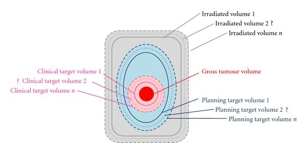
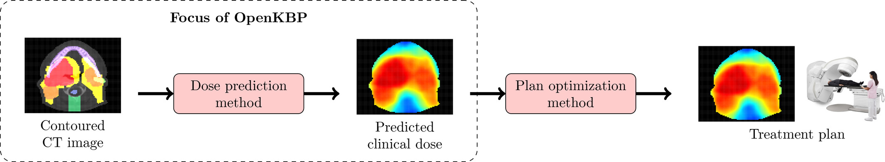

# Physics-Informed Deep Learning for Transformer Based Radiotherapy Dose Prediction
**Gijs de Jong, Jakob Kaiser, Macha Meijer, Thijmen Nijdam and Derck Prinzhorn**
>Supervised by Stefanos Achlatis, s.s.achlatis@uva.nl

---
In this blogpost, the paper ["TrDosePred: A deep learning dose prediction algorithm based on transformers for head and neck cancer radiotherapy"](#4) is discussed, reproduced and extended upon. This paper shows the application of 3D Vision Transformers on the field of radiation dose treatment planning. The goal of this blogpost is to explain the research done in the field of radiation dose prediction, reproduce the work done in the original paper, and extend the TrDosePred architecture by incorporating physics-based elements in the training process. 

#TODO rewrite this such that UNETR is also mentioned

---
# Introduction
<!-- Start with what radiation therapy is, how it is commonly used -->
Radiation therapy is a crucial method in cancer treatment, where about 50% of all patients receive this kind of treatment [[1]](#1). It is used to either shrink a tumor, before using surgery to remove the tumor, or to target cancer cells that are possibly left after the surgery.

Before radiation therapy can be delivered to treat cancer, a treatment plan must be formulated. This plan represents the most optimal configuration of the treatment device, aiming to maximize radiation to the planned target volume (PTV) while minimizing exposure to the organs at risk (OARs). The PTV determines different regions that should receive a minimum percentage of radiation, where regions closer to the tumor should receive more radiation. An example of different PTVs is illustrated in Figure 1. OARs are organs that are sensitive to radiation and should thus receive minimal radiation.

<!-- 
Figure 1: Example of a planned target volume (PTV) [[8]](#8) -->

    
    
Figure 1: Example of a planned target volume (PTV) <a href="#8">[8]</a>

Treatment planning often requires manual adjustments by medical physicists or dosimetrists, introducing variability in plan quality that can affect treatment outcomes, and is very time consuming. To reduce the amount of manual intervention, knowledge-based planning (KBP) can be used. KBP methods are generally formulated as two-stage pipelines (see Figure 2). In the knowledge-based planning approach to treatment planning (see Figure 2), the first step is to create an initial dose distribution, which is typically predicted first using contoured CT images of the patient. The dose distribution contains the amount of radiation that should be given to every individual voxel. After this, an optimization model develops a treatment plan based on this predicted dose distribution. The accuracy of the initial dose distribution can significantly reduce the time required in the overall optimization process [[7]](#7). This research focuses on predicting the initial 3D dose distribution, the first step of the KBP pipeline.

<!-- 
Figure 2: Overview of a complete knowledge-based planning pipeline [[7]](#7) -->

    
    
Figure 2: Overview of a complete knowledge-based planning pipeline <a href="#7">[7]</a>

<!-- Currently treament plan generation with monte carlo, too slow, use DL-->
A popular approach to obtain the initial 3D dose prediction is the Monte Carlo dose calculation [[9]](#9), which uses a combination of simulated and measured beams to compute a dose. While accurate, this approach is slow and it can take minutes to hours for a single dose calculation [[10]](#10). Previous work has improved the speed of these calculations [[10]](#10) [[11]](#11), but it remains a labour-intensive task to create the final treatment plans. Therefore, recent studies have explored deep learning techniques such as Vision Transformers (ViTs) to predict 3D dose distributions that can be used to evaluate or generate treatment plans [[4]](#4) [[12]](#12).

<!-- Related work, what is already done -->
Previous research on dose distribution prediction has investigated a variety of architectural designs. The field was initially advanced by the introduction of the U-Net architecture [[13]](#13), devised for biomedical image segmentation. Its integration of both local and contextual information through convolutional layers and a U-shaped encode-decode architecture makes it suitable for dose prediction applications. The introduction of U-Net gave room to a wide variety of model developments [[14]](#14) [[15]](#15) [[16]](#16). Significant advancements include the transition from predicting 2D dose slices to full 3D dose predictions. Another type of model used for dose prediction is a generative adversarial network (GAN) based architecture [[7]](#7), which achieved state-of-the-art performance and generated more accurate dose distribution predictions.
<!-- Introduction of TrDosePred -->
More recently, with advancements in ViTs [[17]](#17), TrDosePred, a 3D transformer-based algorithm was proposed for dose predictions [[4]](#4). ViTs are capable of modeling long-range dependencies in image data through self-attention mechanisms, enabling them to capture more global context compared to the local receptive fields of convolutional neural networks (CNNs) [[17]](#17).

<!-- Table of contents, what will we talk about -->
In this research, a physics-based approach on dose prediction is presented. This work is based on TrDosePred [[4]](#4) and aims to extend the current research by extending the original framework with physics-based elements, allowing the network to produce dose predictions that are in line with the physics of radiation. However, we encountered difficulties reproducing the original TrDosePred model due to insufficient implementation details. Consequently, we decided to use the UNETR architecture, which also uses a transformer-based encoder. 

In this blogpost, the key components of both [TrDosePred](#TrDosePred) and [UNETR](#UNETR) will be explained and analyzed. Thereafter, we introduce the [physics-based components](#Physics-based-extensions-to-UNETR) that were used to extend the UNETR architecture. We analyze the [results](#Results) of the UNETR architecture and compare it with the physics-based enhancements. Lastly, these results are [discussed](#Conclusion) and possibilities for future research are described.

# TrDosePred
<!-- What is the main idea of TrDosePred -->
TrDosePred leverages a transformer-based approach to predict 3D dose distributions for radiotherapy. Key factors in its success include the ability to model long-range dependencies in the input data by employing 3D Swin Transformer blocks, along with convolutional patch embedding and expanding blocks. The patch embedding block transforms the input into patches that the 3D Swin Transformer blocks process. The patch expanding block reconstructs the final patches into a high-resolution 3D dose distribution. Another crucial factor contributing to TrDosePred's effectiveness is data augmentation, where the limited dataset of 200 training samples is augmented extensively (see the [data](#Data) section for a more extensive description). Additionally, five-fold cross-validation is performed to create an ensemble model, which averages the outputs of five individual models for greater robustness [[4]](#4).

Another component of success is that during inference, robustness of the the model is further enhanced through test-time augmentation, which has proved effective in previous research [[20]](#20). This is done by flipping the input over the different axes to create 4 augmented inputs. These augmented inputs are then passed to each of the five models in the ensemble. After inference, outputs from each model are reverted to their original orientations, resulting in a total of 20 different outputs that are then averaged [[4]](#4). The following sections will provide a detailed explanation of the data, model architecture and limitations of TrDosePred [[4]](#4).

<!-- Explanation of dataset + dataset preprocessing -->
## Data
The data used for training and evaluation are publicly available from the OpenKBP Challenge, designed to standardize benchmarks for dose distribution prediction models. This dataset, known as OpenKBP [[7]](#7), includes 340 head and neck cancer (HNC) patients treated with 6MV IMRT using nine coplanar beams. Each patient has at least one CT scan, one PTV, up to seven OARs, and a dose distribution generated by radiotherapy planning software [[4]](#4). The latter is used as the ground truth dose distribution for the patient. The CT scan provides information on tissue density at each location. The PTVs and OARs are binary masks indicating the regions corresponding to the respective PTV or OAR. Each of these features has dimensions of 128 × 128 × 128 (D x W x H).

The three-channel input volume is a concatenation of the planning CT, OARs, and PTVs, where the seven critical OAR masks are labeled with distinct integers and merged into a single channel by summing them. This results in a final shape of 3 x 128 x 128 x 128 (C x D x W x H). Preprocessing is done as described in the original paper by Hu Chenchen et al. [[4]](#4) and detailed in the [appendix](##Data-Preprocessing). An example of the CT scan and the corresponding ground truth dose distribution can be found in Figure 3.

To enhance the robustness of TrDosePred, data augmentations are applied during training. These include random flipping along the axial[^1] and sagittal[^2] axes, as well as random translation (up to 5 voxels along each axis). Additionally, random rotations are performed around the axial axis of the image, with rotation degrees chosen randomly from a list of 0°, 40°, 80°, 120°, 160°, 200°, 240°, 280°, and 320°.

[^1]: Transverse (axial) plane: separates the upper (superior) and lower (inferior) halves of the body.
[^2]: Sagittal (longitudinal) plane: separates the left and right sides of the body.

The dataset is divided as is done in the OpenKBP challenge [[7]](#7): patients 1-200 for training, patients 201-240 for validation, and patients 241-340 for testing.

    
    
Figure 3a: Example of a CT scan in the dataset </a>

    
    
Figure 3b: Example of a true dose distribution in the dataset 

<!-- Explanation of architecture -->
## Model architecture
Figure 4 illustrates the overall SWIN-based architecture of the proposed TrDosePred. The process begins with a three-channel feature from contoured CT scans serving as the input. Initially, a patch embedding block projects this input into a sequence of patch tokens. Following this, a transformer-based encoder and decoder develop the relationship between the embedded input features and the dose maps. A patch expanding block is then applied to restore the resolution of feature maps after the decoding process. Lastly, a point-wise convolution is utilized to generate the final dose prediction. Detailed descriptions of the individual components are in the [appendix](##Swin-Components).

    
    
Figure 4: Overview of architecture of TrDosePred <a href="#4">[4]</a>

## Metrics
Dose-volume histograms (DVHs) are commonly used to evaluate treatment plans [[6]](#6). DVHs quantify the dose distribution around a target by displaying the absorbed dose for an organ over the relative volume of the organ that reached this dose. An example is shown in Figure 5.

    
    
Figure 5: An example of a dose-volume histogram. Here, the x-axis displays the absorbed dose, while the y-axis explains the volume of the organ that absorbed that dose. Every line represents a different structure.

The DVH score is computed as the MAE of a set of specific criterea. These criterea include the $D_{mean}$ and $D_{0.1cc}$ for the seven OARs and the dose received by 1%, 95% and 99% ($D_1$, $D_{95}$, $D_{99}$) of the voxels within the target volumes for the three PTVs, where $D_{0.1cc}$ is the maximum dose received by the most exposed 0.1 cubic centimeters (cc) of a specified volume.

Another metric used for evaluation is the dose score, which is computed by calculating the MAE between the predicted dose and the target the dose.

Both metrics are expressed in gray (Gy), which is the International System of Units measurement for the absorbed dose of ionizing radiation. Lower scores in both metrics indicate better adherence to clinical objectives.

<!-- Explanation of 2 main limitation: no code and no physics -->
## Limitations
TrDosePred achieves promising results using a fully ViT-based approach, achieve encouraging performance compared to other state-of-the-art models [[4]](#4). However, a critical limitation of TrDosePred is the absence of inherent physics knowledge. The architecture lacks explicit information about the physics of radiation and dose prediction, despite the fact that the predicted dose is highly dependent on how radiation particles move and interact with matter. Incorporating more physics information into the model and training it in a way that aligns with physical principles might lead to dose predictions that are more accurate in relation to the actual treatment plan.

The radiation that is applied during radiotherapy is administered through beams. This means that the dosage of voxels that these beams pass through are very strongly related. For each beam, it should be the case that the amount of dosage reduces as the beam passes through tissue and is absorbed. However, this information is not something that is currently incorporated in the model architecture or loss function.

Another limitation of TrDosePred is the unavailability of the code [[4]](#4). This makes it difficult to reproduce the architecture and continue research in this direction.

# Reproduction
Initially, we implemented the architecture proposed by TrDosePred [[4]](#4) to assess its reproducibility. However, due to insufficient information about the hyperparameters of this architecture, such as the number of multi-head attention blocks and the number of layers in the MLP, and potential bugs that could not be identified due to time constraints, the implemented model failed to achieve proper learning. With limited computational resources, conducting an extensive hyperparameter search was also not feasible. This made us opt for an alternative architecture that incorporates transformers, specifically the UNETR architecture, for which code was available [[22]](#22). Despite being originally proposed for multi-organ segmentation tasks, the UNETR architecture demonstrated superior performance compared to the TrDosePred architecture in our initial experiments. As a result, we decided to evaluate its suitability for dose prediction and further extend on this architecture.

## UNETR
UNETR, which stands for UNet TRansformers, is a hybrid model combining the strengths of CNNs, specifically the U-Net architecture, with transformer-based attention mechanisms.

The UNETR architecture first embeds non-overlapping patches with a dimension of 16 from the image. These patches are then projected into a K-dimensional embedding space using a linear layer. A learnable one-dimensional embedding is then added to preserve positional information. The final embeddings have a size of 768. These embeddings are passed through a stack of 12 transformer blocks, each consisting of a layer of multi-head self-attention (MSA) and MLPs. The equations are as follows:

$$\textbf{z}'_i = \text{MSA}(\text{Norm}(\textbf{z} _{i-1})) + \textbf{z} _{i-1}$$

$$\textbf{z}'_i = \text{MLP}(\text{Norm}(\textbf{z}_i)) + \textbf{z}'_i$$

Where $\text{Norm}$ indicates Layer Norm, and each MLP consists of two linear layers with a $\text{GELU}$ activation function. Each MSA sublayer includes $n$ self-attention (SA) heads. Each SA block is a parameterized function that maps queries ($q$) to corresponding keys ($k$) and values ($v$) within a sequence $z \in \mathbb{R}^{N \times K}$. To compute the attention weights, the similarity between elements in $z$ and their key-value pairs is evaluated as follows:

$$A = \text{Softmax}(\frac{\textbf{qk}^T}{\sqrt K_h})$$

where $K_h$ is used as a scaling factor. This attention can then be used to compute the output of a single SA block as follows:

$$ \text{SA}(\textbf{v}) = A\textbf{v}$$

The output of the entire MIA block can then be formulated as follows:

<!--$$\text{MSA}(\textbf{z}) = ( \text{SA}_1(\textbf{z}), \text{SA}_2(\textbf{z}), ..., \text{SA}_n (\textbf{z})) W_{\text{msa}} $$ -->

$$\text{MSA}(\textbf{z}) = (SA_{1}(\textbf{z}), SA_{2}(\textbf{z}), \ldots, SA_n(\textbf{z})) W_{\text{msa}} $$

where $W_{\text{msa}}$ are trainable parameter weights for the MSA block.

Features from different levels of resolution from the encoder are then merged with the decoder to form a U-Net inspired architecture. At each resolution, the features are projected from the embedding space of that resolution into the input space by utilizing 3x3x3 convolutional layers, followed by batch normalization layers. This is then concatenated with the output of the following transformer block that is upsampled using a deconvolutional layer.

After all the features from all resolutions have been combined, the resulting features are fed into a 1x1x1 convolutional layer followed by a softmax activation function to generate the final dose prediction.

## Training
The dataset provided by <a href="#7">[7]</a> was mirrored to [Hugging Face](https://huggingface.co/datasets/oxkitsune/open-kbp) to utilize the `datasets` library. This library enables fully parallelized data preprocessing, which is also cached for efficient loading during training.

Using PyTorch's `DataParallel` module, the model is trained on multiple GPUs in parallel. During training, each GPU performs a forward pass on a subset of the batch, storing the gradients. Once the entire batch is processed, the gradients are collected on a single GPU to perform a backward pass.

Each model has been trained for 300 epochs with a batch size of 4 on NVIDIA A100 GPUs, each with 40Gb of memory. The learning rate follows the CosineAnnealingLR scheduler, as detailed in <a href="#23">[23]</a>, with a maximum learning rate of $1 \times 10^{-4}$, aligning with the original work [[4]](#4).

<!-- Introduction to contributions -->
# Physics-based extensions to UNETR
<!-- Describe your novel contribution. -->
This work introduces a physics-based approach of UNETR. Specifically, the UNETR framework is augmented with physics-based elements. The expectation is that these elements will make the model perform better, given the inherently physics-dependent nature of radiation as described in the [limitations](##Limitations).

Multiple methdologies exist for integrating physics into neural networks [[18]](#18). In this research, two specific approaches are explored. Firstly, the loss function is augmented with a physics-based component. Secondly, an autoregressive strategy is employed to capture dependencies between different segments of the prediction. The subsequent sections provide a detailed explanation of these two methodologies.

<!-- Explanation of loss variants-->
## Physics-based loss
In fields where physics plays a critical role, such as turbulence modelling, the use of physics-inspired loss functions has demonstrated promising results [[2]](#2) [[3]](#3). These loss functions have been shown to enhance both the performance and stability of the neural networks to which they are applied.

For dose prediction, common loss functions include the mean absolute error (MAE) and mean squared error (MSE). Since TrDosePred, the model we originally tried to reproduce, utilizes the MAE loss function, we opted for this as well. In this context, $D_{pred}$ represents the predicted dose and $D_{true}$ is the ground truth.

$$L_{MAE}(D_{pred}, D_{true}) = \frac{1}{N}\sum_{i}|D^i_{pred} - D^i_{true}|$$

A frequently used technique involves modifying the loss function of a model by incorporating physics-based regularization terms. Specifically, this approach utilizes the MAE loss as a foundation, upon which a weighted physics-based loss component is added. This additional loss term can be domain-specific and encodes relationships that are particularly relevant to the domain of the model's application.

$$Loss = L_{MAE}(D_{pred}, D_{true}) + w_{phy} Loss_{phy}(D_{pred}).$$

Here, $`Loss_{phy}`$ is the physics-based loss and $w_{phy}$ is the weight given to the physics-based loss.

Typically, the weight $w_{phy}$ is selected such that the contribution of the physics-based loss is smaller than that of the primary loss function, which, in our case, is the MAE loss. This ensures that while the physics-based constraints influence the model, they do not overshadow the main predictive objective.

### DVH loss

DVHs are essential for ensuring that the prescribed radiation dose effectively targets the tumor while minimizing exposure to healthy tissues and the critical organs. Therefore, incorporating DVH information into the model training process can be beneficial. To this end, a DVH loss function has been proposed [[5]](#5), which is a differential approximation of the DVH.

Given a binary segmentation mask, $B_s$ for the $s$-th structure, along with the predicted and ground truth doses, the mean squared loss of the DVH can be defined as follows:

$$L_{DVH}(D_{true}, D_{pred}, B_{s}) = \frac{1}{n_s}\frac{1}{n_t}\sum_s \lVert DVH(D_{true}, B_s) - DVH(D_{pred}, B_s) \rVert_2^2.$$

where $n_s$ represents the number of structures and $n_t$ denotes the number of different bins in the histogram.
This loss function can be integrated into the total loss function as follows:
$$Loss = L_{MAE} + w_{DVH}\cdot L_{DVH}, $$
where $w_{DVH}$ is the weight given to the DVH loss.

The DVH of a dose and a structure mask for the $s$-th structure can be expressed as:

$$DVH(D, B_s) = (v_{s, d_1}, v_{s, d_2}, ..., v_{s, d_n})$$

where $v_{s, d_t}$ represents the volume-at-dose corresponding to the dose $d_t$. Each value in the DVH corresponds to a distinct bin in the histogram. Specifically, $v_{s, d_t}$ is defined as the fraction of the volume of a region-of-interest (ROI), which can be either an OAR or a PTV, receiving a dose of at least $d_t$. This value can be approximated as:

$$v_{s, t}(D, B_s) = \frac{\sum_i\sigma(\frac{D(i) - d_t}{\beta})B_s(i)}{\sum_iB_s(i)}.$$

Here, $\sigma$ denotes the sigmoid function, $\sigma(x) = \frac{1}{1+e^{-x}}$, $D(i)$ is the dose at voxel $i$, $d_t$ is the threshold dose, $\beta$ represents the histogram bin width and $B_s(i)$ whether voxel $i$ belongs to the $s$-th structure.

DVH loss can be regarded as a physics-based loss function because it directly incorporates the physical properties and constraints of radiation dose distribution into the loss calculation.

### Moment loss
Moment loss is a variant of the DVH loss. It is based on the concept that a DVH can be approximated using several moments of a structure, which are different quantative measures to represent a function, such as the mean or the maximum [[5]](#5). A DVH can be approximated using several moments as follows:

$$ DVH \sim (M_1, M_2, ..., M_p). $$

Here, $M_p$ represents the moment of order p, which is defined as:
$$M_p = \left(\frac{1}{|V_s|}\sum_{j\in V_s}d^p_j\right) ^\frac{1}{p}$$

where $V_s$ denotes the voxels belonging to the $s$th structure and $d$ represents the dose.

Different moments of a structure capture various characteristics of the structure. For instance, $M_1$ corresponds to the mean dose, while $M_\inf$ corresponds to the maximum dose. In practice, the 10th moment ($M_{10}$) can be used to approximate the maximum dose. In our experiments, the moments 1, 2 and 10 are used to compute the loss, following the work of [[5]](#5).

Based on the DVH approximation, the final moment loss is calculated as:
$$L_{moment} = \sum_{p\in P}||M_p - \tilde{M}_p ||_2^2$$

Here, $\tilde{M}_p$ denotes the corresponding moment derived from the predicted dose.

Integrating the moment loss function in the model training process is analogous to incorporating the DVH loss and is represented as follows:

$$Loss = L_{MAE} + w_{Moment}\cdot L_{Moment},$$

where $w_{Moment}$ denotes the weight assigned to the moment loss function. Lastly, following the research of [[5]](#5), the MAE, DVH loss and Moment loss can be combined into a unified loss function:

$$Loss = L_{MAE} + w_{DVH}\cdot L_{DVH} + w_{Moment}\cdot L_{Moment}$$

<!-- Explanation of Autoregression -->
## Autoregression
<!-- Two-three methods -->

Autoregressive methods are used to predict sequences by conditioning on previous predictions. In the context of dose prediction, autoregression helps in model dependencies between different slices of the predicted dose. These slices could be axial slices (across X, Y or Z) or can be along the beam eye view (BEV) axes, which correspond to the directions of the various radiation beams. There are multiple approaches to incorporating autoregression in this context.

#### 1. Autoregressive input masking
In the first method, an additional channel is added to the model input, which is a masked 3D dose. Thus, the input is a concatentation of CT, PTVs, OARs and the masked 3D dose:

$$x = [CT, PTVs, OARs, Mask],$$

where $Mask$ is the masked 3D dose. Based on this input, the model predicts a small slice of the dose at each step. The prediction is formulated as:

$$D_{\text{pred, slice}} = f(x).$$

Here, $f$ denotes the function implemented by the model to predict the dose slice from the concatenated input.

After predicting a slice, it is incorporated back into the masked 3D dose input for the subsequent prediction. This iterative process ensures that the model leverages its previous predictions to inform future ones. The process continues until the entire dose volume is predicted.
The loss function is calculated based on the incrementally predicted slices:

$$L_{\text{slice}}(D_{\text{pred, slice}}, D_{\text{true,slice}} ) = \frac{1}{K} \sum_{j}^K \left| D^j_{\text{pred, slice}} - D^j_{\text{true,slice}} \right|$$

where $D_{\text{pred, slice}}$ represents the predicted slice dose, $D_{\text{true,slice}}$ represents the ground truth slice dose and $K$ denotes the total number of elements in the slice.

#### Teacher forcing extension
Teacher forcing is a technique used in training autoregressive models to improve performance. During training, rather than using the model's own predictinos as inputs for subsequent steps, ground truth data is utilized. This involves feeding observed sequence values (i.e. ground-truth samples) back into the model after each step with a certain probability, guiding the model to remain close to the ground truth sequence. This method can teach the model to be inherently autoregressive by implicitly learning to make the next slice prediction.

In the context of our dose prediction model, teacher forcing can be applied by replacing the predicted dose slices with the ground truth dose slices during the training process. Mathematically, this implies that instead of updating the masked 3D dose input with $D_{pred, slice}$, it is updated with $D_{true, slice}$.

This approach may be particularly beneficial when conditioning along BEV axes, as it allows for incremental updates to the model with information from the previous beam.

#### 2. RNN based neural network
Another technique to incorporate autoregressiveness into the model is by modifying the model's architecture. In the default model setup, the model uses a decoder that predicts the entire $D_{\text{pred}}$ at once. We aim to replace this decoder with an RNN-based decoder to introduce autoregression, enabling the model to predict dose slices sequentially. Instead of feeding the masked input back into the model, as in the first autoregressive method, the RNN leverages its hidden states to maintain context and continuity between predictions.

    
    
Figure 6: Simple version of an RNN. 

A typical RNN works by the following formula:
$$h_t = \tanh(x_t W_{ih}^T + b_{ih} + h_{t-1} W_{hh}^T + b_{hh}),$$ where $h_t$ is the hidden state at time $t$, $x_t$ is the input at time $t$, and $h_{t-1}$ is the hidden state from the previous time step ($t-1$) or the initial hidden state at time $0$. However, since we are dealing with 3D structures, we implement a convolutional approach (ConvRNN), which functions similarly but is adapted for 3D inputs.

    
    
Figure 7: A UNETR inspired Convolutional RNN. 

The UNETR architecture is modified to use a ConvRNN in the output decoding. The ConvRNN process starts from the latent dimension produced by the UNETR encoder, which is a combination of three residual streams.

To make computation more feasible, the size of the residual stream is reduced from $768$ to $128$ and the patch size is increased from $16$ to $32$. The latent representation $\textbf{z}$ obtained from the encoder, includes features from CT, PTVs, and OARs:

$$ \textbf{z} = [z_3, z_6, z_9] = \text{UNETREncoder}\left([CT, PTVs, OARs]\right). $$

The ConvRNN processes the latent features and maintains hidden states $h_t$ that capture information about previous predictions. The initial hidden state $h_0$ is initialized as $z \in \mathbf{z}$. This allows the model to perform a single forward pass to predict the entire dose volume, decoding it slice by slice.

Let $\mathbf{x}$ be the CT image and its features, $\text{Conv}(\mathbf{x}) = \mathbf{f}$ be the convolutional block producing the feature map $\mathbf{f}$, and $\text{Slice}(\mathbf{f}) = f_t$ be the operation that selects a specific slice, resulting in the slice feature map $f_t$.
$$\mathbf{x} \xrightarrow{\text{Conv}(\cdot)} \mathbf{f} \xrightarrow{\text{Slice}(\cdot)} f_t$$ At each time step $t$, the ConvRNN then updates its hidden state based on the previous hidden state, the latent representation and the slice-specific CT feature map:
\begin{equation}
o_t, h_t = \text{ConvRNN}\left(h_{t-1}, f_t\right),
\end{equation} where $h_{t-1}$ is the hidden state from the previous time step, $f_t$ are features specific to the current slice and $o_t$ is the output from the current ConvRNN step.

Each output is then concatenated to construct $\textbf{o}$. Finally, $\mathbf{o}$ is jointly decoded with the CT feature map to a final $D_{pred}$:
$$D_{pred} = \text{DecoderConv} \left(\mathbf{f}, \mathbf{o}\right)$$

This recurrent methodology can be applied to each latent dim $z$, by decoding, upsampling and concatenating every intermediate $\mathbf{o}$, and finally decoding it jointly with the CT feature map, as visualized below.

    
    
Figure 8: A schematic overview of the augmented UNETR architecture with integrated RNN blocks (in red). 

# Results
We conducted both reproduction and extension experiments. Since we could not reproduce the original research of TrDosePred [[4]](#4), we opted to use the UNETR architecture [[22]](#22) for our experiments instead. 

### Model complexity
To assess the effect of model complexity on this unexplored architecture for the dose prediction domain, we created two variants of the UNETR architecture, one with 9 and another with 12 transformer blocks. The results of this reproduction are shown in Table 1.

| Architecture | DVh score | Dose score |
| ------------ | --------- | ---------- |
| TrDosePred   | **2.512** | **1.658**  |
| 9-block UNETR | 4.252     | 5.587      |
| 12-block UNETR | #TODO    | #TODO      |

Table 1: Results of the UNETR architecture with various model sizes, compared against the results reported in the original work introducing TrDosePred. Lower scores are better, and the best results are denoted in bold.

Table 1 shows that the TrDosePred model outperformed the 9-block UNETR model in both DVH score and Dose score, as indicated by the lower scores. This suggests that the original TrDosePred model is more effective than the reproduced 9-block UNETR model based on these metrics.

#TODO: add comparison with 12-block model
#TODO: which architecture is used for the following experiments? + add 12-block

    
    
Figure 9: Visualisation of the prediction and the true dose distribution. 

In Figure 9, a visualization of a prediction by the 9-block UNETR model is shown and compared to the true dose distribution. The model is able to capture the general shape of the true dose distribution. The main difference between the prediction and the target is that target has more structure that originates from the radiation beams.

### Physics-based approaches 

Following the development of a 3D-dose prediction model, several experiments involving the integration of physics-based elements were conducted. These experiments can be divided into two categories: those utilizing a physics-based loss function and those employing an autoregression approach.

### Physics-based loss
In Table 2, the results of using a physics-based loss are displayed. A total of four experiments were conducted. The baseline is the model trained using only the MAE loss. Additionally, combinations of MAE with other losses were tested: MAE+DVH, MAE+Moment, and MAE+DVH+Moment. The hyperparameters used to weight the different loss functions were chosen such that the DVH loss and moment loss are roughly a factor of ten smaller than the MAE loss. The $w_{DVH}$ employed was $1 \times 10^{-5}$, and $w_{Moment}$ was set at $5 \times 10^{-6}$.

#TODO: add shortly why factor of 10 was chosen

| Loss | DVH score | Dose score |
| -------- | -------- | -------- |
| MAE     | 4.252     | **5.587**     |
| MAE + DVH    | 4.777     | 5.730     |
| MAE + Moment    | **4.233**     | 5.706     |
| MAE + DVH + Moment    | 6.785     | 8.811     |

Table 2: Results of the different physics-based loss functions. The best results are denoted in bold.

In Table 2, the results of various loss experiments are shown. Generally, the model trained with a simple MAE loss appears to perform better than those using DVH or Moment losses. The scores for MAE+Moment are very similar to those of the MAE model, except the DVH score, which is slightly improved in the MAE+Moment model. This suggests that incorporating physics-based loss functions might enhance model performance. However, the lack of an extensive hyperparameter search, due to limited computational resources, could have hindered improvements. Such a search could potentially significantly enhance performance when using physics-based losses, as ... 

#TODO shortly explain why hyperparam search could improve, which hyperparams?

### Autoregression
Lastly, an autoregressive approach was explored. For this, two different techniques that incorporate autoregression in the model were implemented, namely a input masking approach and an RNN based approach. Generating results for the input masking autoregressor was not feasible, as due to computational limitations the duration of each iteration increased exponentially. The RNN approach, on the other hand, did not have these limitations. Thus, these results are shown in Table 3

| Autoregression | DVH score | Dose score |
| -------- | -------- | -------- |
| MAE     | 4.252     | 5.587     |
| MAE + RNN    | **3.811**     | **4.927**     |

Table 3: Results of RNN-based method versus base model using MAE loss. Best results are denoted in bold.

From Table 3, we can observe that the MAE + RNN approach shows significant improvements over the simple MAE baseline in both DVH score and Dose score. This suggests that incorporating autoregressive techniques, specifically using RNNs, can enhance model performance.

#TODO
qualitative results for everything, at least some images of how the dose predictions look like, if possible some sort of animation over slices.

# Conclusion
In this study, we aimed to reproduce and extend the research presented in the paper "TrDosePred: A deep learning dose prediction algorithm based on transformers for head and neck cancer radiotherapy". The original research used a transformer-based approach, specifically ViTs, to predict 3D dose distributions in radiotherapy treatment planning. Our goal was to both validate these findings and enhance the model by incorporating physics-based elements.

We encountered difficulties reproducing the original TrDosePred model due to the lack of detailed implementation specifics. Consequently, we decided to use the UNETR architecture as an alternative. The results of our reproduction experiments demonstrated that the original TrDosePred model outperformed the 3-block UNETR variant in both DVH and Dose scores. As a results, we could not validate the effectiveness of the UNETR architecture as a direct replacement for TrDosePred.

To improve upon the existing models, we integrated physics-based elements into the training process. These elements included physics-inspired loss functions and autoregressive techniques. In the experiments involving physics-based loss functions, the MAE + Moment loss exhibited a slight improvement in DVH score compared to the simple MAE baseline, though the overall performance remained similar. However, the other combined losses did not perform as well as the MAE or MAE + Moment loss functions. We believe a hyperparameter search could further enhance performance, as these initial results have demonstrated potential for improvement.

The most significant improvement over the original UNETR architecture came from incorporating autoregressive techniques. The MAE + RNN approach, which utilized RNNs to model dependencies between different segments of the dose prediction, significantly improved both DVH and Dose scores compared to the baseline MAE loss. This suggests that modeling dependencies between different segments of the dose prediction can enhance the accuracy of the models. However, we are comparing our extensions against a non-optimally configured architecture that has not yet been thoroughly evaluated in this domain, which means our results should generally be taken with caution.

## Future work
When continuing the research on incorporating physics-based elements in the field of 3D dose distribution using transformers, various topics might be interesting to research. In this research, there where two main limitations, namely the limited computational resources and the limited dataset. The dataset used only contained the final true 3D dose distribution. However, in practice, there is a 3D dose distribution per radiation beam, on which the final treatment plan is based. This data allows for more physics-based elements to be introduced into the transformer. Two key elements that could be added are using a Lambert-based loss function and doing autoregression along the beam axis. The Lambert law is based on the idea that every structure absorbs a different amount of radiation. This is something that is extremely relevant in the field of dose prediction and could make the final predicted distribution more accurate. Secondly, the dose distribution for different beams rely heavily on each other, since one beam may be able to radiate a specific structure while another beam cannot radiate this structure without damaging an organ. Therefore, applying autoregression per beam might make the final distribution more accurate. We also see that in the current models, the beam structure is missing in the predictions. We expect that this structure will be more present in models that are trained using beam data.

In addition to this, future research might look into reproducing the original work of TrDosePred with the SWIN-3D architecture. In this research, it was not possible to do this due to the lack of detail in the original paper. Contacting the authors was attempted, but unfortunately, no response was received. Reproducing the original work with help of the authors might make the field of 3D dose prediction using transformer-based architecture more accessible for further research. Also, when more computational resources are available, it would be interesting to do a more extensive hyperparameter search, especially for the physics-based loss functions.

## Individual contributions
<!-- Close the notebook with a description of each student's contribution. -->
This project can roughly be divided into three components: reproducing the original paper, creating physics-based loss functions and making the original model autoregressive. The main focus of Jakob and Gijs was the reproduction, the main focus of Macha was the physics-based losses and the main focus of Derck and Thijmen was the autoregression.

## References
<a id="1">[1]</a> Baskar, R., Lee, K. A., Yeo, R., & Yeoh, K. W. (2012). Cancer and radiation therapy: current advances and future directions. International journal of medical sciences, 9(3), 193.

<a id="2">[2]</a> List, B., Chen, L. W., & Thuerey, N. (2022). Learned turbulence modelling with differentiable fluid solvers: physics-based loss functions and optimisation horizons. Journal of Fluid Mechanics, 949, A25.

<a id="3">[3]</a> Raymond, S. J., & Camarillo, D. B. (2021). Applying physics-based loss functions to neural networks for improved generalizability in mechanics problems. arXiv preprint arXiv:2105.00075.

<a id="4">[4]</a> Hu, Chenchen, et al. "TrDosePred: A deep learning dose prediction algorithm based on transformers for head and neck cancer radiotherapy." Journal of Applied Clinical Medical Physics 24.7 (2023): e13942.

<a id="5">[5]</a> Nguyen, D., McBeth, R., Sadeghnejad Barkousaraie, A., Bohara, G., Shen, C., Jia, X., & Jiang, S. (2020). Incorporating human and learned domain knowledge into training deep neural networks: a differentiable dose‐volume histogram and adversarial inspired framework for generating Pareto optimal dose distributions in radiation therapy. Medical physics, 47(3), 837-849.

<a id="6">[6]</a> Drzymala, R. E., Mohan, R., Brewster, L., Chu, J., Goitein, M., Harms, W., & Urie, M. (1991). Dose-volume histograms. International Journal of Radiation Oncology* Biology* Physics, 21(1), 71-78.

<a id="7">[7]</a> Babier, A., Zhang, B., Mahmood, R., Moore, K. L., Purdie, T. G., McNiven, A. L., & Chan, T. C. (2021). OpenKBP: the open‐access knowledge‐based planning grand challenge and dataset. Medical Physics, 48(9), 5549-5561.

<a id="8">[8]</a> Moghaddasi, Leyla & Bezak, Eva & Marcu, Loredana. (2012). In Silico Modelling of Tumour Margin Diffusion and Infiltration: Review of Current Status. Computational and mathematical methods in medicine. 2012. 672895. 10.1155/2012/672895.

<a id="9">[9]</a> Ma, C. M., Li, J. S., Pawlicki, T., Jiang, S. B., Deng, J., Lee, M. C., ... & Brain, S. (2002). A Monte Carlo dose calculation tool for radiotherapy treatment planning. Physics in Medicine & Biology, 47(10), 1671.

<a id="10">[10]</a> Jabbari, K. (2011). Review of fast Monte Carlo codes for dose calculation in radiation therapy treatment planning. Journal of Medical Signals & Sensors, 1(1), 73-86.

<a id="11">[11]</a> Jia, X., Gu, X., Graves, Y. J., Folkerts, M., & Jiang, S. B. (2011). GPU-based fast Monte Carlo simulation for radiotherapy dose calculation. Physics in Medicine & Biology, 56(22), 7017.

<a id="12">[12]</a> Meerbothe, T. (2021). A physics guided neural network approach for dose prediction in automated radiation therapy treatment planning.

<a id="13">[13]</a> Ronneberger, O., Fischer, P., & Brox, T. (2015). U-net: Convolutional networks for biomedical image segmentation. In Medical image computing and computer-assisted intervention–MICCAI 2015: 18th international conference, Munich, Germany, October 5-9, 2015, proceedings, part III 18 (pp. 234-241). Springer International Publishing.

<a id="14">[14]</a> Gronberg, M. P., Gay, S. S., Netherton, T. J., Rhee, D. J., Court, L. E., & Cardenas, C. E. (2021). Dose prediction for head and neck radiotherapy using a three‐dimensional dense dilated U‐net architecture. Medical physics, 48(9), 5567-5573.

<a id="15">[15]</a> Kontaxis, C., Bol, G. H., Lagendijk, J. J. W., & Raaymakers, B. W. (2020). DeepDose: Towards a fast dose calculation engine for radiation therapy using deep learning. Physics in Medicine & Biology, 65(7), 075013.

<a id="16">[16]</a> Nguyen, D., Jia, X., Sher, D., Lin, M. H., Iqbal, Z., Liu, H., & Jiang, S. (2019). 3D radiotherapy dose prediction on head and neck cancer patients with a hierarchically densely connected U-net deep learning architecture. Physics in medicine & Biology, 64(6), 065020.

<a id="17">[17]</a> Dosovitskiy, A., Beyer, L., Kolesnikov, A., Weissenborn, D., Zhai, X., Unterthiner, T., ... & Houlsby, N. (2020). An image is worth 16x16 words: Transformers for image recognition at scale. arXiv preprint arXiv:2010.11929.

<a id="18">[18]</a> Karpatne, A., Watkins, W., Read, J., & Kumar, V. (2017). Physics-guided neural networks (pgnn): An application in lake temperature modeling. arXiv preprint arXiv:1710.11431, 2.

<a id="19">[19]</a> Xiao, T., Singh, M., Mintun, E., Darrell, T., Dollár, P., & Girshick, R. (2021). Early convolutions help transformers see better. Advances in neural information processing systems, 34, 30392-30400.

<a id="20">[20]</a> Shanmugam, D., Blalock, D., Balakrishnan, G., & Guttag, J. (2021). Better Aggregation in Test-Time Augmentation. arXiv preprint arXiv:2011.11156.

<a id="21">[21]</a> Liu, Z., Lin, Y., Cao, Y., Hu, H., Wei, Y., Zhang, Z., Lin, S., & Guo, B. (2021). Swin Transformer: Hierarchical Vision Transformer using Shifted Windows. arXiv preprint arXiv:2103.14030

<a id="22">[22]</a> Hatamizadeh, A., Tang, Y., Nath, V., Yang, D., Myronenko, A., Landman, B., Roth, H., & Xu, D. (2021). UNETR: Transformers for 3D Medical Image Segmentation. arXiv preprint arXiv:2103.10504

<a id="23">[23]</a> Loshchilov, I., & Hutter, F. (2016). Sgdr: Stochastic gradient descent with warm restarts. arXiv preprint arXiv:1608.03983.

# Appendix

## Data Preprocessing
The preprocessing steps taken for the data used in each channel are as follows:
- The OAR Channel involves labeling seven critical OAR masks with distinct integers and merging them into a single channel by summing them. Specifically, the labels are as follows: 1 for the brain stem, 2 for the spinal cord, 3 for the right parotid, 4 for the left parotid, 5 for the esophagus, 6 for the larynx, and 7 for the mandible. 
- For the Planning CT Channel, CT values are cropped to range from -1024 to 1500 and then divided by 1000. 
- In the PTV Channel, each voxel inside PTVs is assigned the corresponding prescription dose. For each voxel, the maximum value over all PTVs is taken, and the resulting channel is normalized by 70 Gy.

## Swin Components

This section goes into detail on specific components of the SWIN model architecture [[21]](#21).

### Patch Embedding and Expanding Block

Traditionally in ViTs, the input image is split and mapped to non-overlapping patches before being fed into the transformer encoder. However, recent research suggests that using overlapping patches can improve optimization stability and performance [[19]](#19). Inspired by this, TrDosePred's patch embedding block extracts patches from the input volume using stacked overlapping convolutional layers.

The patch embedding block comprises three submodules, each with a 3×3×3 convolution, an Instance Normalization, and a Gaussian Error Linear Units (GELU) activation function. A point-wise convolution with 96 filters projects these features into embedding tokens, reducing the feature dimensions by a factor of 2×4×4 (Figure 10a).

Symmetrically, a patch expanding block with a 2×4×4 transpose convolution and 3×3×3 convolutions is used to recover the resolution of feature maps after decoding. A point-wise convolution is then employed to generate the final dose prediction (Figure 10b).

    

        
        
Figure 10a: Patch embedding block <a href="#4">[4]</a>

    

    

        
        
Figure 10b: Patch expanding block <a href="#4">[4]</a>

    

### Transformer-Based Encoder and Decoder

After patch embedding, the tokens are fed into a U-shaped encoder and decoder, featuring multiple 3D Swin Transformer blocks. Compared to the vanilla transformer, the Swin Transformer is more efficient for medical image analysis due to its linear complexity relative to image size.

Each 3D Swin Transformer block consists of a window-based local multi-head self-attention (W-MSA) module and a Multi-layer Perceptron (MLP) module (Figure 11). Depth-wise convolution is added to the MLP to enhance locality, and Layer Normalization (LN) and residual connections are applied before and after each module.

The windows are cyclically shifted between consecutive transformer blocks to establish cross-window connections. The computational steps for two consecutive 3D Swin Transformer blocks are as follows:

1. The input to the first block is normalized using LN and then processed by the 3D W-MSA module.
2. The output of the W-MSA module is added to the input via a residual connection.
3. This output is then normalized again and passed through the MLP module.
4. The output of the MLP module is added to the input via another residual connection.

$$
Z_i' = \text{3D W-MSA}(\text{LN}(Z_{i-1})) + Z_{i-1}
$$

$$
Z_i = \text{MLP}(\text{LN}(Z_i')) + Z_i'
$$

For the next block, the same steps are repeated with a shifted window-based self-attention:

$$
Z_{i+1}' = \text{3D SW-MSA}(\text{LN}(Z_i)) + Z_i
$$

$$
Z_{i+1} = \text{MLP}(\text{LN}(Z_{i+1}')) + Z_{i+1}'
$$

Here, $Z_i'$ and $Z_i$ denote the output of the 3D(S)W-MSA and MLP module for the $i$-th block, respectively.

The attention in each 3D local window is computed as:

$$
\text{Attention}(Q, K, V) = \text{SoftMax}\left(\frac{QK^T}{\sqrt{d_k}} + B\right)
$$

where $Q$, $K$, $V$ represent the query, key, and value matrices; $d_k$ is the dimension of the query and key, and $B$ is the bias matrix.

Between the encoder and decoder blocks, down-sampling and up-sampling layers are inserted to adjust the feature map sizes as described in the previous section.

    
    
Figure 11: Two consecutive Swin Transformer blocks <a href="#4">[4]</a>

