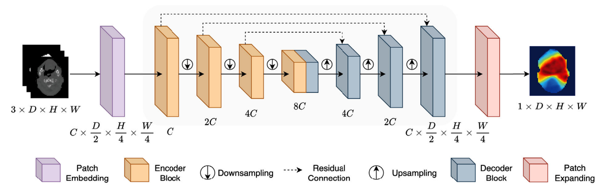

# TrDosePred - A physics-based approach
**Gijs de Jong, Jakob Kaiser, Macha Meijer, Thijmen Nijdam and Derck Prinzhorn**

---
In this blogpost, the paper ["TrDosePred: A deep learning dose prediction algorithm based on transformers for head and neck cancer radiotherapy"](#4) is discussed, reproduced and extended upon. This paper shows the application of 3D Vision Transformers on the field of radiation dose treatment planning. The goal of this blogpost is to explain the research done in the field of radiation dose prediction, reproduce the work done in the original paper, and extending the TrDosePred architecture by incorporating physics-based elements in the training process.

---
# Introduction
<!-- Start with what radiation therapy is, how it is commonly used -->
Radiation therapy is often used in cancer treatment, where about 50% of all patients receive this kind of treatment [[1]](#1). It can either be used to shrink a tumor, before using surgery to remove the tumor, or it is used to target cancer cells that are possibly left after the surgery.

Before radiation therapy can be delivered to treat cancer, a treatment plan must be formulated. This plan represents the most optimal configuration of the treatment device, aiming to maximize radiation to the planned target volume (PTV) while minimizing exposure to the organs at risk (OARs). The PTV determines different regions that should receive a minimum percentage of radiation. For example, the region closest around the tumor should get a higher percentage radiation, while a larger region around the tumor can get a slightly lower percentage radiation. An example of different PTVs is illustrated in Figure 1. OARs are organs that are sensitive to radiation and should thus receive as less radiation as possible.

Figure 1: Example of a planned target volume (PTV) [[8]](#8)

<!-- Generating treatment plans is hard, explanation of treatment plans -->
Treatment planning often requires manual adjustments by medical physicists or dosimetrists, introducing variability in plan quality that can affect treatment outcomes, and is very time consuming. Efforts to reduce this manual intervention is called automated treatment planning and can be divided into two categories, objective-based planning (OBP) and knowledge-based planning (KBP). OBP relies on optimization algorithms that adjust preset objectives to achieve the established clinical goals. KBP  uses a library of plans from previous patients to predict dose–volume objectives for the new patient. KBP methods are generally formulated as two-stage pipelines (see Figure 2). In the knowledge-based planning approach to treatment planning (see Figure 2), the first step is to create an initial dose distribution, which is typically predicted first using contoured CT images of the patient. Subsequently, an optimization model develops a treatment plan based on this predicted dose distribution. The accuracy of the initial dose distribution is crucial, as it significantly reduces the time required in the overall optimization process [[7]](#7). This research focuses on predicting the initial 3D dose prediction, the first step of the KBP pipeline.

Figure 2: Overview of a complete knowledge-based planning pipeline [[7]](#7)

<!-- Currently treament plan generation with monte carlo, too slow, use DL-->
Currently, a popular approach to obtain the initial 3D dose prediction is the Monte Carlo dose calculation [[9]](#9), which uses a combination of simulated and measured beams to compute a dose. While accurate, this approach is slow and it can take several hours for a single dose calculation [[10]](#10). Previous work has improved the speed of these calculations [[10]](#10) [[11]](#11), but it remains a labour intensive task to create the final treatment plans. Therefore, recent studies have explored deep learning techniques such as ViT to predict 3D dose distributions that can be used to evaluate or generate treatment plans [[4]](#4) [[12]](#12).

<!-- Related work, what is already done -->
Previous research on dose distribution prediction has investigated a variety of architectural designs. The field was initially advanced by the introduction of the U-Net architecture [[13]](#13), which was originally devised for biomedical image segmentation. Its integration of both local and contextual information through convolutional layers and a U-shaped encode-decode architecture makes it suitable for dose prediction applications. The introduction of U-Net gave room to a wide variety of model developments [[14]](#14) [[15]](#15) [[16]](#16). Significant advancements include the transition from predicting 2D dose slices to full 3D dose predictions. Another type of model used for dose prediction is a generative adversarial network (GAN) based architecture [[7]](#7), which achieved state-of-the-art performance and generated more realistic dose distribution predictions.
<!-- Introduction of TrDosePred -->
More recently, with advancements in Vision Transformers (ViTs) [[17]](#17), TrDosePred, a 3D transformer-based algorithm was proposed for dose predictions [[4]](#4). ViTs are capable of modeling long-range dependencies in image data through self-attention mechanisms, enabling them to capture more global context compared to the local receptive fields of CNNs [[17]](#17).
<!-- Table of contents, what will we talk about -->
In this research, a physics-based approach on dose prediction is presented. This work is based on TrDosePred [[4]](#4) and aims to extend the current research by extending the original framework with physics-based elements, allowing the network to produce dose predictions that are in line with the physics of radiation.

First of all, the key components of TrDosePred will be [explained](#TrDosePred) and [analysed](#Analysis-of-TrDosePred). Thereafter, we introduce the [physics-based components](#TrDosePred---A-physics-based-approach) that were used to extend the original TrDosePred. We analyze the [results](#Results) of the original TrDosePred architecture and compare it with the physics network. Lastly, these results are [discussed](#Conclusion) and possibilities for future research are described.

# TrDosePred
<!-- What is the main idea of TrDosePred -->
TrDosePred leverages a transformer-based approach to predict 3D dose distributions for radiotherapy. Key factors in its success include the ability to model long-range dependencies in the input data by employing 3D Swin Transformer blocks, along with convolutional patch embedding and expanding blocks. The patch embedding block transforms the input into patches that the 3D Swin Transformer blocks process. The patch expanding block reconstructs the final patches into a high-resolution 3D dose distribution. Another crucial factor contributing to TrDosePred's effectiveness is data augmentation, where the limited dataset of 200 training samples is augmented extensively (see the [data](#Data) section for a more extensive description). Additionally, five-fold cross-validation is performed to create an ensemble model, which averages the outputs of five individual models for greater robustness [[4]](#4).

Another component of success is that during inference, the model further enhances robustness through test-time augmentation. This involves augmenting the input by flipping it along multiple axes. After inference, the output is reverted to its original orientation, resulting in 20 different outputs accross the five models that are then averaged [[4]](#4). The following sections will provide a detailed explanation of the data and model architecture.

<!-- Explanation of dataset + dataset preprocessing -->
## Data
The data used for training and evaluation is publicly available from the OpenKBP Challenge, designed to standardize benchmarks for dose distribution prediction models. This dataset, known as OpenKBP [[7]](#7), includes 340 head and neck cancer (HNC) patients treated with 6MV IMRT using nine coplanar beams. Each patient has at least one PTV, up to seven OARs, and a dose distribution generated by a Computational Environment for Radiotherapy Research (CERR), which is used as the ground truth dose distribution for the patient [[4]](#4). 

The three-channel input volume is a concatenation of planning CT, OARs, and PTVs. The specifics of each channel are as follows:

- **Planning CT Channel:** CT values are cropped to range from -1024 to 1500 and then divided by 1000.
- **PTV Channel:** Each voxel inside PTVs is assigned the corresponding prescription dose and normalized by 70 Gy.
- **OAR Channel:** Seven critical OAR masks are labeled with distinct integers and merged into a single channel: 1 for the brain stem, 2 for the spinal cord, 3 for the right parotid, 4 for the left parotid, 5 for the esophagus, 6 for the larynx, and 7 for the mandible.

To enhance the robustness of TrDosePred, data augmentations were applied during training. These included random flipping along the inferior-superior and right-left axes, as well as random translation (up to 20 voxels along each axis). Additionally, random rotations around the inferior-superior axis were performed, with rotation degrees chosen randomly from a list of 0°, 40°, 80°, 120°, 160°, 200°, 240°, 280°, and 320°.

Each planning CT volume has a fixed dimension of 128 × 128 × 128 and an approximate resolution of 3.5 mm × 3.5 mm × 2 mm. The dataset was divided as follows: patients 1-200 for training, patients 201-240 for validation, and patients 241-340 for testing.

<!-- Explanation of architecture -->
## Model architecture

Figure 3 shows the overall architecture of the proposed TrDosePred. With a three-channel feature of contoured CT as input, a patch embedding block first projects it into a sequence of patch tokens. A transformer-based encoder and decoder then build the relationship between embedded input features and dose maps. Finally, a patch expanding block generates the 3D dose distribution. The individual components are further elaborated on in the following sections.

    
    
Figure 3: Overview of architecture of TrDosePred <a href="#4">[4]</a>

### Patch Embedding and Expanding Block

Traditionally in Vision Transformers (ViT), the input image is split and mapped to non-overlapping patches before being fed into the transformer encoder. However, recent research suggests that using overlapping patches can improve optimization stability and performance [[19]](#19). Inspired by this, TrDosePred's patch embedding block extracts patches from the input volume using stacked overlapping convolutional layers.

The patch embedding block comprises three submodules, each with a 3×3×3 convolution, an Instance Normalization, and a Gaussian Error Linear Units (GELU) activation function. A point-wise convolution with 96 filters projects these features into embedding tokens, reducing the feature dimensions by a factor of 2×4×4 (Figure 4a).

Symmetrically, a patch expanding block with a 2×4×4 transpose convolution and 3×3×3 convolutions is used to recover the resolution of feature maps after decoding. A point-wise convolution is then employed to generate the final dose prediction (Figure 4b).

    

        
        
Figure 4a: Patch embedding block <a href="#4">[4]</a>

    

    

        
        
Figure 4b: Patch expanding block <a href="#4">[4]</a>

    

### Transformer-Based Encoder and Decoder

After patch embedding, the tokens are fed into a U-shaped encoder and decoder, featuring multiple 3D Swin Transformer blocks. Compared to the vanilla transformer, the Swin Transformer is more efficient for medical image analysis due to its linear complexity relative to image size.

Each 3D Swin Transformer block consists of a window-based local multi-head self-attention (W-MSA) module and a Multi-layer Perceptron (MLP) module (Figure 5). Depth-wise convolution is added to the MLP to enhance locality, and Layer Normalization (LN) and residual connections are applied before and after each module.

The windows are cyclically shifted between consecutive transformer blocks to establish cross-window connections. The computational steps for two consecutive 3D Swin Transformer blocks are as follows:

1. The input to the first block is normalized using LN and then processed by the 3D W-MSA module.
2. The output of the W-MSA module is added to the input via a residual connection.
3. This output is then normalized again and passed through the MLP module.
4. The output of the MLP module is added to the input via another residual connection.

$$
Z_i' = \text{3D W-MSA}(\text{LN}(Z_{i-1})) + Z_{i-1} 
$$

$$
Z_i = \text{MLP}(\text{LN}(Z_i')) + Z_i' 
$$

For the next block, the same steps are repeated with a shifted window-based self-attention:

$$
Z_{i+1}' = \text{3D SW-MSA}(\text{LN}(Z_i)) + Z_i 
$$

$$
Z_{i+1} = \text{MLP}(\text{LN}(Z_{i+1}')) + Z_{i+1}' 
$$

Here, $Z_i'$ and $Z_i$ denote the output of the 3D(S)W-MSA and MLP module for the $i$-th block, respectively.

The attention in each 3D local window is computed as:

$$
\text{Attention}(Q, K, V) = \text{SoftMax}\left(\frac{QK^T}{\sqrt{d_k}} + B\right) 
$$

where $Q$, $K$, $V$ represent the query, key, and value matrices; $N_T$ represents the number of tokens in a 3D window; $d_k$ is the dimension of the query and key, and $B$ is the bias matrix.

Between the encoder and decoder blocks, down-sampling and up-sampling layers are inserted to adjust the feature map sizes as described in the previous section.

    
    
Figure 5: Two consecutive Swin Transformer blocks <a href="#4">[4]</a>

## Analysis of TrDosePred
<!-- An analysis of the paper and its key components. Think about it as a nicely formatted review as you would see on OpenReview.net. It should contain one paragraph of related work as well. -->
TrDosePred achieves impressive performance on the OpenKBP dataset, with a dose score of 2.426 Gy and a DVH score of 1.592 Gy, ranking 1st and 3rd, respectively. The model demonstrates this performance with limited data and holds potential for further improvement with larger datasets.

Performance was assessed using mean absolute error-based dose score and DVH score. Additional ablation studies highlighted the effectiveness of key architectural components in enhancing performance, such as the convolutional sampling strategy and the depth-wise convolution in the MLP.

<!-- Exposition of its weaknesses/strengths/potential which triggered your group to come up with a response. -->

<!-- Explanation of strenghts -->
In summary, the strengths of the overall approach include the innovative use of transformers, making TrDosePred the first to demonstrate the transformer architecture in dose prediction, achieving state-of-the-art performance in accurate dose predictions, and validating the model's effectiveness through ablation studies that identify key components contributing to its performance.

<!-- Explanation of 2 main limitation: no code and no physics -->
### Limitations

Currently, TrDosePred achieves the best results in the field of 3D dose prediction using a machine learning-based approach. However, a critical limitation of TrDosePred is the absence of inherent physics knowledge. The architecture lacks explicit information about the physics of radiation and dose prediction, despite the fact that the predicted dose is highly dependent on how radiation particles move and behave. Incorporating more physics information into the model and training it in a way that aligns with physical principles might lead to dose predictions that are more accurate in relation to the actual treatment plan.

Secondly, the model currently assumes independence among different prediction points. Since the model predicts a 3D dose for each voxel, it fails to account for the fact that radiation is emitted in beams. Therefore, the predicted dose of a specific voxel is highly dependent on the predicted doses of neighboring voxels.

Lastly, a limitation of TrDosePred is the unavailability of the code [[4]](#4). This makes it difficult to reproduce the architecture and continue research in this direction.

<!-- Introduction to contributions -->
## TrDosePred - A physics-based approach
<!-- Describe your novel contribution. -->
This work proposes a physics-based approach of TrDosePred. In practice, this means that the work of TrDosePred is extended by adding physics-based elements. The expectation is that these elements will make the model perform better, since the problem of radiation prediction highly depends on the physics related to radiation.

<!-- Explanation of loss variants-->
<!-- First of all, training the model with a physics-inspired loss function might lead to increased physics-awareness of the model. In other fields, using these type of loss functions lead to increased performance and stability of the network [[2]](#2) [[3]](#3). This technique is part of Physics-Informed Neural Networks (PINNs). -->

### DVH loss
There are various approaches to incorporating physics into neural networks [[18]](#18). In other fields, a method that showed promising results is using physics-inspired loss functions [[2]](#2) [[3]](#3). Using these loss function led to both increased performance and stability of the network. 

The loss generally used for dose prediction are the mean absolute error loss (MAE) or mean squared error loss (MSE). Specifically, TrDosePred utilizes MAE. Here, $D_{pred}$ is the predicted dose and $D_{true}$ is the ground truth.

$$
    L_{MAE}(D_{pred}, D_{true}) = \frac{1}{N}\sum_{i}|D^i_{pred} - D^i_{true}|
$$

A frequently used approach is to adjust the loss function of a model by adding physics-dependent regularization terms. This means that the MAE loss is used as a basis, and on top of that, a weighted physics-based loss is added.
$$
    Loss = L_{MAE}(D_{pred}, D_{true}) + w_{phy} Loss_{phy}(D_{pred}).
$$

In dose prediction, dose-volume histograms (DVHs) are commonly used to evaluate treatment plans [[6]](#6). DVHs are used to quantify the dose distribution around a target. They display the absorbed dose of an organ, over the relative volume of the organ that reached this dose. An example is shown in Figure 6.

Figure 6: An example of a dose-volume histogram. Here, the x-axis displays the absorbed dose, while the y-axis explains the volume of the organ that absorbed that dose.

In treatment planning, DVHs are essential to ensure that the prescribed dose of radiation effectively targets the tumor while minimizing exposure to healthy tissues and critical organs. Therefore, it is useful to train the model on the DVH information. From this, a DVH loss was proposed [[5]](#5). This is a differential approximation of DVH. Given a binary segmentation mask, $M_s$ for the $s$-th structure, and the predicted and ground truth doses, we can then define a mean squared loss of the DVH as:

$$
    L_{DVH}(D_{true}, D_{pred}, M_{s}) = \frac{1}{n_s}\frac{1}{n_t}\sum_s \lVert DVH(D_{true}, M_s) - DVH(D_{pred}, M_s) \rVert_2^2.
$$

which can be incorporated in the total loss function like this:
$$
    Loss = L_{MAE} + w_{DVH}\cdot L_{DVH}
$$

Here, the DVH of a dose and a structure mask for the $s$-th structure can be represented as:

$$
    DVH(D, B_s) = (v_{s, d_1}, v_{s, d_2}, ..., v_{s, d_n})
$$

where $v_{s, d_t}$ represents the volume-at-dose with respect to the dose dt. This can be defined as the fraction of the volume of a given region-of-interest, which can be either an OAR or a PTV, which receives a dose of at least $d_t$. This can be approximated as 

$$
    v_{s, t}(D, B_s) = \frac{\sum_i\sigma(\frac{D(i) - d_t}{\beta})B_s(i)}{\sum_iB_s(i)}
$$

where $\sigma$ is the sigmoid function $\sigma(x) = \frac{1}{1+e^{-x}}$, $\beta$ represents the histogram bin width and $i$ is equal to the voxel indices of the dose distribution.

### Moment loss
Moment loss is a variant of the DVH loss described above. The moment loss is based on the idea that a DVH can be approximated using several moments of a structure [[5]](#5). The moment loss follows the equation

$$
DVH \sim (M_1, M_2, ..., M_p)
$$

where $M_p$ is the moment of order p, which can be defined as

$$
M_p = \left(\frac{1}{|V_s|}\sum_{j\in V_s}d^p_j\right) ^\frac{1}{p}
$$

where $V_s$ are the voxels that belong to the $s$th structure and $d$ is equal to the dose.

The different moments of a structure represent different features of the structure. For example, $M_1$ is equal to the mean dose, and $M_\inf$ is equal to the maximum dose. In practice, the 10th moment can be used to approximate the maximum dose. In our experiments, the moments 1, 2 and 10 are used to compute the loss, following the work of [[5]](#5).

Based on the DVH approximation, the final moment loss can be computed as: 
$$
L_{moment} = \sum_{p\in P}||M_p - \tilde{M}_p ||_2^2
$$

Integrating the moment loss function in the model training works the same as with the DVH loss and looks like the following:

$$
    Loss = L_{MAE} + w_{Moment}\cdot L_{Moment}
$$

<!-- Explanation of Autoregression -->
### Autoregression
<!-- Two-three methods -->

Autoregressive methods are used to predict sequences by conditioning on previous predictions. In the context of dose prediction, autoregression helps model dependencies between different patches or slices of the predicted dose. These slices could be axial slices (across X, Y or Z), but could also be across beam eye view (BEV) axes, which are the axes of the different radiation beams. There are multiple ways to incorporate autoregression.
#### 1. Autoregressive input masking
In the first method, we add an extra channel to the input of the model which will be a masked 3D dose. Therefore, the input is a concatentation of CT, PTV, OAR and the Masked 3D dose: 
$$
x = [CT, PTV, OAR, Mask],
$$
where $Mask$ is the masked 3D dose. Based on this input, the model predicts a small patch or slice of the dose at each step. The prediction can be represented as:
$$
D_{\text{pred, patch}} = f(x),
$$
where $f$ represents the model. After predicting a patch or slice, it is incorporated back into the masked 3D dose input for the next prediction. This process ensures that the model uses its previous predictions to inform future ones. The process continues until the entire dose volume is predicted.
We have two setups of how to compute the loss. The first one is a loss based on the final predicted dose, calculated as:
$$
L_{MAE}(D_{pred}, D_{true}) = \frac{1}{N}\sum_{i}|D^i_{pred} - D^i_{true}|
$$
where $D^i_{\text{true}}$ is the ground truth dose and $N$ is the number of voxels.
The second loss is based on the incrementally predicted patches:
$$
L_{\text{patch}}(D_{\text{patch}}, D_{\text{true,patch}} ) = \frac{1}{K} \sum_{j} \left| D^j_{\text{pred, patch}} - D^j_{\text{true,patch}} \right|
$$
where  $K$ is the number of elements in the patch, $D_{\text{pred, patch}}$ is the predicted dose for the patch, and $D_{\text{true,patch}}$ is the ground truth dose for the patch.

##### Teacher forcing extension
Teacher forcing is a technique used in training autoregressive models to improve performance. Instead of using the model's own predictions as inputs for the next step, the ground truth data is used during training. It involves feeding observed sequence values (i.e. ground-truth samples) back into the model after each step, thus forcing the model to stay close to the ground-truth sequence. It can teach the model to be inherently autoregressively, as it learns implicitly that it should make a next patch prediction.

In the context of our dose prediction model, teacher forcing can be applied by replacing the predicted dose patches with the ground truth dose patches during the training process. Mathematically, this means that instead of updating the masked 3D doe input with $D_{pred, patch}$, we update it with $D_{true, patch}$. 

This may be specifically useful when conditioning along BEV axes, as we could incrementally update the model with information of the previous beam.

#### 2. RNN based neural network
* Replace output decoder by an RNN.
* Use hidden states to process the previous predictions instead of a masked input.
* Use teacher forcing as a way to inherently make the sequence more focused on the ground truth

Another technique which can be used to incorporate autoregressiveness into the model, is by changing the model's architecture. In the default setup, the model uses a decoder that predicts the entire $D_{\text{pred}}$ at once. We aim to replace this decoder by an RNN-based decoder to introduce autoregression, allowing the model to predict dose patches/slices sequentially.

The model architecture is modified to use an RNN (e.g. LSTM or GRU) as the output decoder. The RNN process starts from the latent dimension produced by the SWIN3D encoder. Let $z$ denote the latent representation obtained from the SWIN3D encoder, which includes features from CT, PTV, and OAR:
$$
z = \text{SWIN3D_Encoder}\left([CT, PTV, OAR]\right)
$$
The RNN processes the latent features and maintains hidden states $H_t$ that capture information about previous predictions. The initial hidden state $h_0$ is typically initialized as zeros or learned parameters. Instead of feeding the masked input back into the model (like in autoregression 1), the RNN uses its hidden states to remember the previous predictions. This allows the model to perform a single forward pass to predict the entire dose volume, decoding it patch by patch. 

###### Option 1: every timestep a specific CT feature
Let $\text{CT}^t_{\text{features}}$ be the CT features specific to the patch being processed at time step $t$. At each time step $t$, the RNN then updates its hidden state based on the previous hidden state, the latent representation and the patch-specific CT features:

$$
h_t = \text{RNN}\left(h_{t-1}, [z, CT^t_{\text{features}}]\right),
$$
where $h_{t-1}$ is the hidden state from the previous time step, $z$ is the latent representation, and $CT^t_{\text{features}}$ are the CT features specific to the current patch.

###### Option 2: every time step the previous prediction output

At each time step $t$, the RNN updates its hidden state based on the previous hidden state and the previous prediction. The initial hidden state $h_0$ is typically initialized to zeros or learned parameters. The input at the first time step includes the latent representation $z$:

$$
h_1 = \text{RNN}(h_0, z)
$$

For subsequent time steps, the RNN uses the previous prediction as input:

$$
h_t = \text{RNN}(h_{t-1}, D_{\text{pred, patch}, t-1}),
$$

where $h_{t-1}$ is the hidden state from the previous time step and $\hat{D}_{\text{patch}, t-1}$ is the predicted dose patch from the previous time step. The predicted dose patch at each step is given by:

$$
D_{\text{pred, patch}, t} = f(h_t),
$$

where $f$ represents the function mapping the hidden state $h_t$ to the dose patch $\hat{D}_{\text{patch}, t}$.

###### Teacher forcing
During training, teacher forcing can be used to improve the learning process. This involves using the ground truth patches $ D_{\text{true,patch}, t}$ as inputs to the RNN at each step, instead of the RNN's own predictions $D_{\text{pred, patch}, t}$. Mathematically, the input to the RNN at each step during training is:

$$
h_{t} = \text{RNN}(h_{t-1}, D_{\text{true,patch}, t-1})
$$

Instead of:

$$
h_{t} = \text{RNN}(h_{t-1}, D_{\text{pred, patch}, t-1})
$$

The loss function for the RNN-based method is computed based on the predicted dose patches and the ground truth dose patches. 
<!-- #### 3. 
3. Neural translation method
* Based on translation task
* Uses any type of encoder, and transformer based decoder
* Encoder can use full input
* Decoder has for each prediction acess to the encoded state which has global information
* Decoder predicts patches autoregressively using masked self-attention, thus only allowing the model to use information of previoulsy predicted patches for its predictions. 
 -->

<!-- Explanation of KANs?-->

## Results
<!-- Results of your work (link that part with the code in the jupyter notebook) -->

## Conclusion

### Individual contributions
<!-- Close the notebook with a description of each student's contribution. -->

## References
<a id="1">[1]</a> Baskar, R., Lee, K. A., Yeo, R., & Yeoh, K. W. (2012). Cancer and radiation therapy: current advances and future directions. International journal of medical sciences, 9(3), 193.

<a id="2">[2]</a> List, B., Chen, L. W., & Thuerey, N. (2022). Learned turbulence modelling with differentiable fluid solvers: physics-based loss functions and optimisation horizons. Journal of Fluid Mechanics, 949, A25.

<a id="3">[3]</a> Raymond, S. J., & Camarillo, D. B. (2021). Applying physics-based loss functions to neural networks for improved generalizability in mechanics problems. arXiv preprint arXiv:2105.00075.

<a id="4">[4]</a> Hu, Chenchen, et al. "TrDosePred: A deep learning dose prediction algorithm based on transformers for head and neck cancer radiotherapy." Journal of Applied Clinical Medical Physics 24.7 (2023): e13942.

<a id="5">[5]</a> Nguyen, D., McBeth, R., Sadeghnejad Barkousaraie, A., Bohara, G., Shen, C., Jia, X., & Jiang, S. (2020). Incorporating human and learned domain knowledge into training deep neural networks: a differentiable dose‐volume histogram and adversarial inspired framework for generating Pareto optimal dose distributions in radiation therapy. Medical physics, 47(3), 837-849.

<a id="6">[6]</a> Drzymala, R. E., Mohan, R., Brewster, L., Chu, J., Goitein, M., Harms, W., & Urie, M. (1991). Dose-volume histograms. International Journal of Radiation Oncology* Biology* Physics, 21(1), 71-78.

<a id="7">[7]</a> Babier, A., Zhang, B., Mahmood, R., Moore, K. L., Purdie, T. G., McNiven, A. L., & Chan, T. C. (2021). OpenKBP: the open‐access knowledge‐based planning grand challenge and dataset. Medical Physics, 48(9), 5549-5561.

<a id="8">[8]</a> Moghaddasi, Leyla & Bezak, Eva & Marcu, Loredana. (2012). In Silico Modelling of Tumour Margin Diffusion and Infiltration: Review of Current Status. Computational and mathematical methods in medicine. 2012. 672895. 10.1155/2012/672895. 

<a id="9">[9]</a> Ma, C. M., Li, J. S., Pawlicki, T., Jiang, S. B., Deng, J., Lee, M. C., ... & Brain, S. (2002). A Monte Carlo dose calculation tool for radiotherapy treatment planning. Physics in Medicine & Biology, 47(10), 1671.

<a id="10">[10]</a> Jabbari, K. (2011). Review of fast Monte Carlo codes for dose calculation in radiation therapy treatment planning. Journal of Medical Signals & Sensors, 1(1), 73-86.

<a id="11">[11]</a> Jia, X., Gu, X., Graves, Y. J., Folkerts, M., & Jiang, S. B. (2011). GPU-based fast Monte Carlo simulation for radiotherapy dose calculation. Physics in Medicine & Biology, 56(22), 7017.

<a id="12">[12]</a> Meerbothe, T. (2021). A physics guided neural network approach for dose prediction in automated radiation therapy treatment planning.

<a id="13">[13]</a> Ronneberger, O., Fischer, P., & Brox, T. (2015). U-net: Convolutional networks for biomedical image segmentation. In Medical image computing and computer-assisted intervention–MICCAI 2015: 18th international conference, Munich, Germany, October 5-9, 2015, proceedings, part III 18 (pp. 234-241). Springer International Publishing.

<a id="14">[14]</a> Gronberg, M. P., Gay, S. S., Netherton, T. J., Rhee, D. J., Court, L. E., & Cardenas, C. E. (2021). Dose prediction for head and neck radiotherapy using a three‐dimensional dense dilated U‐net architecture. Medical physics, 48(9), 5567-5573.

<a id="15">[15]</a> Kontaxis, C., Bol, G. H., Lagendijk, J. J. W., & Raaymakers, B. W. (2020). DeepDose: Towards a fast dose calculation engine for radiation therapy using deep learning. Physics in Medicine & Biology, 65(7), 075013.

<a id="16">[16]</a> Nguyen, D., Jia, X., Sher, D., Lin, M. H., Iqbal, Z., Liu, H., & Jiang, S. (2019). 3D radiotherapy dose prediction on head and neck cancer patients with a hierarchically densely connected U-net deep learning architecture. Physics in medicine & Biology, 64(6), 065020.

<a id="17">[17]</a> Dosovitskiy, A., Beyer, L., Kolesnikov, A., Weissenborn, D., Zhai, X., Unterthiner, T., ... & Houlsby, N. (2020). An image is worth 16x16 words: Transformers for image recognition at scale. arXiv preprint arXiv:2010.11929.

<a id="18">[18]</a> Karpatne, A., Watkins, W., Read, J., & Kumar, V. (2017). Physics-guided neural networks (pgnn): An application in lake temperature modeling. arXiv preprint arXiv:1710.11431, 2.

<a id="19">[19]</a> Xiao, T., Singh, M., Mintun, E., Darrell, T., Dollár, P., & Girshick, R. (2021). Early convolutions help transformers see better. Advances in neural information processing systems, 34, 30392-30400.

